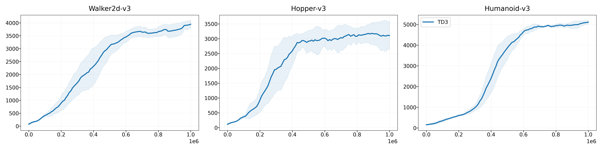

# Neural Episodic Control with State Abstraction

|     Env Name    |       TD3      |      GEM      |     NECSA     |
|-----------------|----------------|---------------|---------------|
|  Walker2d-v3    |  3974.7±145.1  |     |      |
|  Hopper-v3      |  3001.9±502.2  |     |      |
|  Humanoid-v3    |  4968.5±242.0  |     |      |

