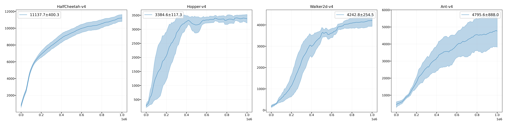
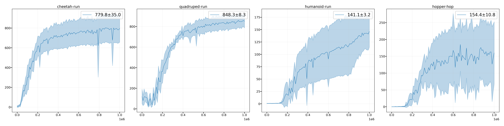

# Soft Actor-Critic (SAC)

A Jax implemenation of SAC for continuous control tasks.

## Baselines

Performance on some benchmark tasks: the average of the last 10 evaluation scores across 5 random seeds.

### MuJoCo

|     Env Name    |     FPS     |  Reward  |
|-----------------|-------------|----------|
|  HalfCheetah-v4 |  980~1050   |  14311   |
|  Hopper-v4      |  990~1010   |   2947   |
|  Walker2d-v4    |  920~960    |   5447   |
|  Ant-v4         |  730~750    |   5927   |

### DeepMind Control Suite

|     Env Name    |     FPS     |  Reward  |
|-----------------|-------------|----------|
|  cheetah-run    |   990~1010  |   780    |
|  quadruped-run  |   730~750   |   848    | 
|  humanoid-run   |   660~680   |   141    |
|  hopper-hop     |   930~960   |   154    |

