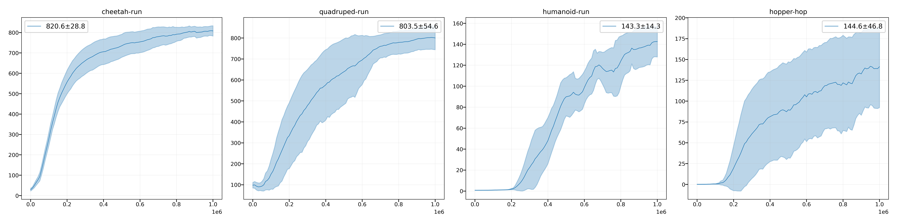

# Soft Actor-Critic (SAC)

A Jax implemenation of SAC for continuous control tasks.

## Baselines

Performance on some benchmark tasks: the average of the last 10 evaluation scores across 5 random seeds.

### MuJoCo


|     Env Name    |     FPS     |  Reward  |
|-----------------|-------------|----------|
|  HalfCheetah-v2 |  1020~1050  |  14311   |
|  Hopper-v2      |  990~1010   |   2947   |
|  Walker2d-v2    |  960~980    |   5447   |
|  Ant-v2         |  730~750    |   5927   |


### DeepMind Control Suite

|     Env Name    |     FPS     |  Reward  |
|-----------------|-------------|----------|
|  cheetah-run    |   990~1010  |   839    |
|  quadruped-run  |   730~750   |   773    | 
|  humanoid-run   |   660~680   |   132    |
|  hopper-hop     |   860~880   |   201    |



## Reset


## Reset

```python
# physics.data.qacc_warmstart
from dm_control import suite

def create():
    env = suite.load(domain_name='cartpole', task_name='swingup', task_kwargs={'random': 32})
    state = np.array([1.3, 5.3, 0.1, 2.3])
    action = np.array([0.3])
    phys = env.physics
    env.reset()
    phys.set_state(state)
    env.step(action)
    obs1 = phys.render()
    obs2 = phys.render()
    h = lambda img : hash(img.data.tobytes())
    print('>>>> should be equal', h(obs1), h(obs2))

create()
create()
```

## Some implementation details

SAC is overall a stable baseline. However, in some tasks, the performance changes a lot even we only modify one impletation detail.

- Entropy alpha loss: `log_alpha` or `alpha`.
- Tanh normal policy: how to compute the `log_std`, use `distrax` or `tfd`.
- Initialization: `orthogonal` or `glorut_uniform`.
- Critic loss: times `0.5`.
