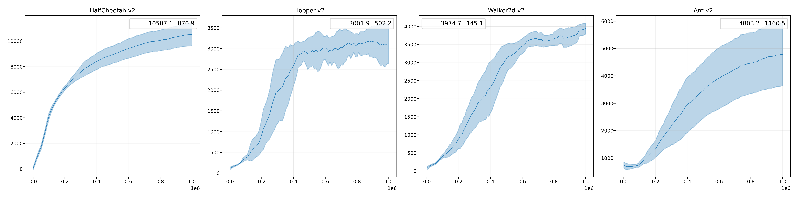
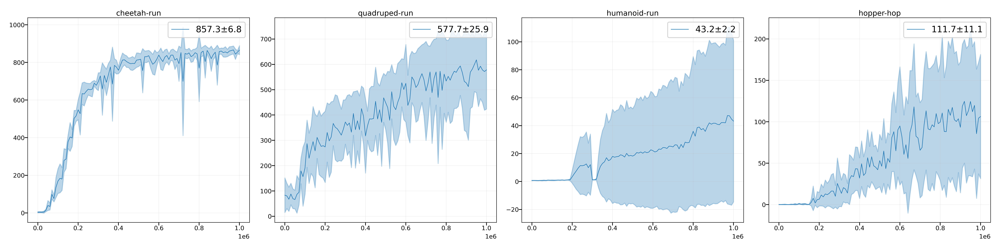

# Twin Delayed Deep Deterministic Policy Gradients (TD3)

A Jax implemenation of TD3 for continuous control tasks.

## Baselines

Performance on some benchmark tasks: the average of the last 10 evaluation scores across 5 random seeds.

|     Env Name    |     FPS     |  Reward  |
|-----------------|-------------|----------|
|  HalfCheetah-v2 |  1220~1240  |  13742   |
|  Hopper-v2      |  1170~1190  |   3049   |
|  Walker2d-v2    |  1120~1150  |   5011   |
|  Ant-v2         |  900~920    |   5949   |

### DeepMind Control Suite

|     Env Name    |     FPS     |  Reward  |
|-----------------|-------------|----------|
|  cheetah-run    |   1130~1150 |   857    |
|  quadruped-run  |   860~890   |   578    | 
|  humanoid-run   |   770~790   |    43    |
|  hopper-hop     |   1060~1080 |   112    |

